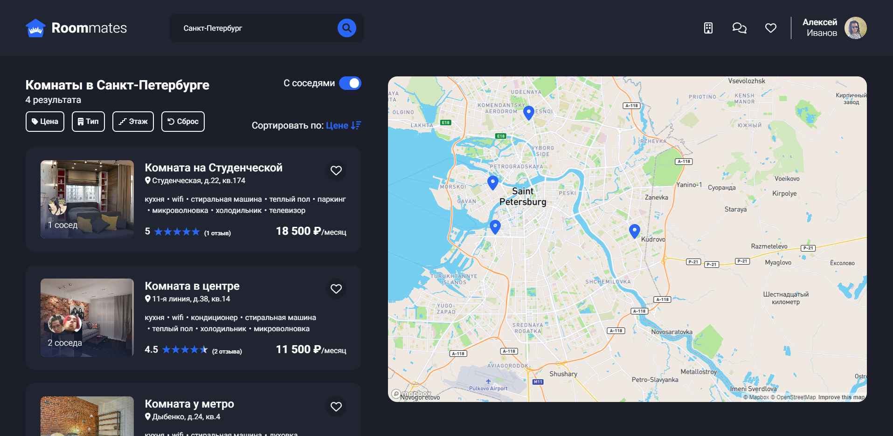

    

<h1 align="center">Roommates</h1>

<h2 align="center">
    <a href="https://roommates-profpopoff.vercel.app/">Live Demo</a>
</h2>

### Test user:

- test@email.com
- 1234

---

---

## About the project

**Roommates** is a web app for renting apartments with roommates.

### Technological stack:

- Next.js
- MongoDB 
- Mongoose
- Socket.IO
- Redux
- Scss
- MapBox
- Cloudinary
  
### Functional requirements:

- Registration/authorization
- Creating, viewing, editing and deleting ads about real estate
- Search for real estate using filters, search input or interactive map
- Rating system for real estate
- Chat for tenants and landlords to communicate
- Tenants control system
<<<<<<< HEAD
- Save images to cloude server
=======
- Save images to cloude server

### Technological stack:

- Next.js
- MongoDB (mongoose)
- Redux
- Scss
>>>>>>> 0e3cf9fc58d138c157790f866da1ed217032164b
